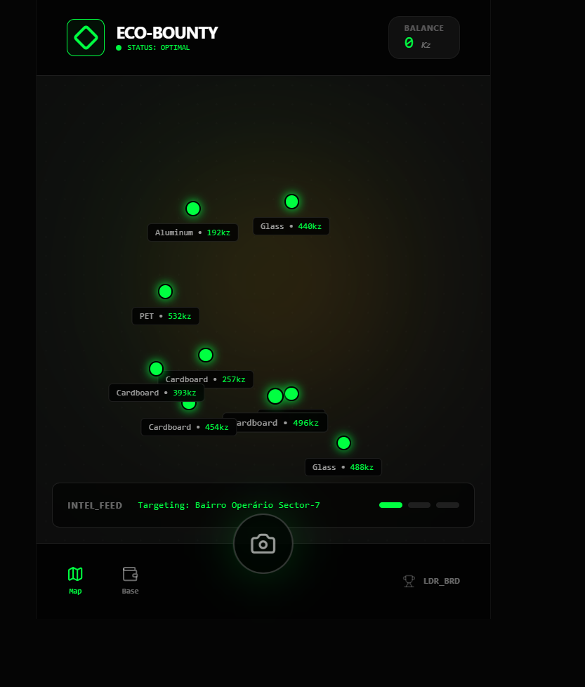
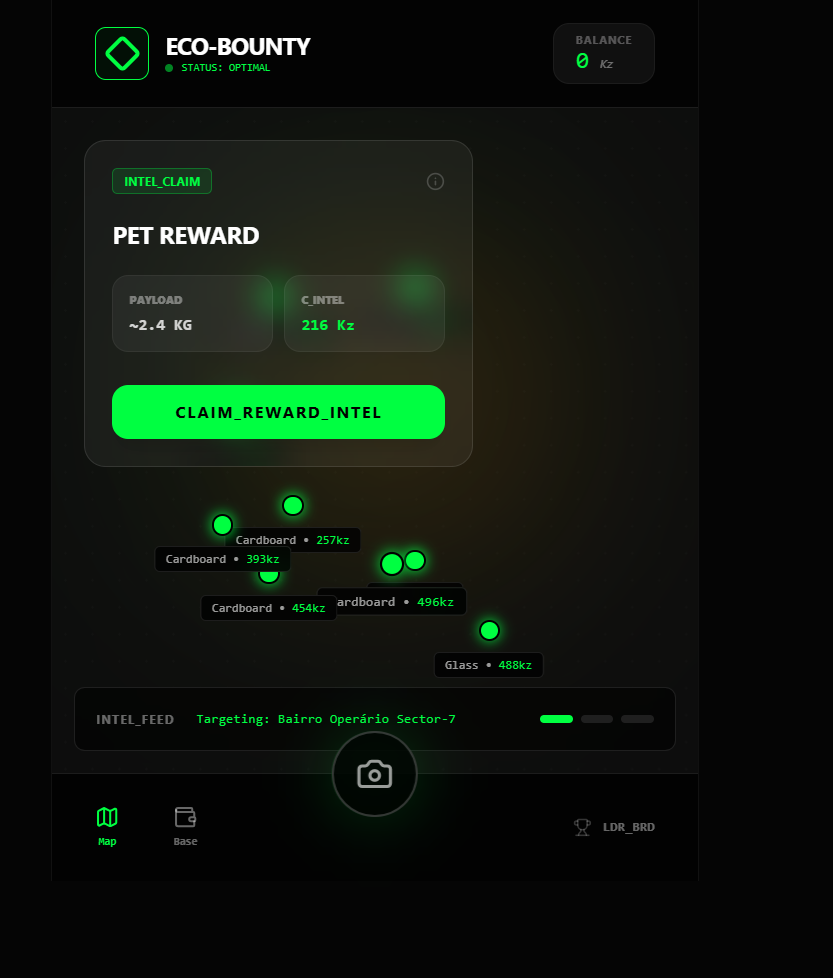
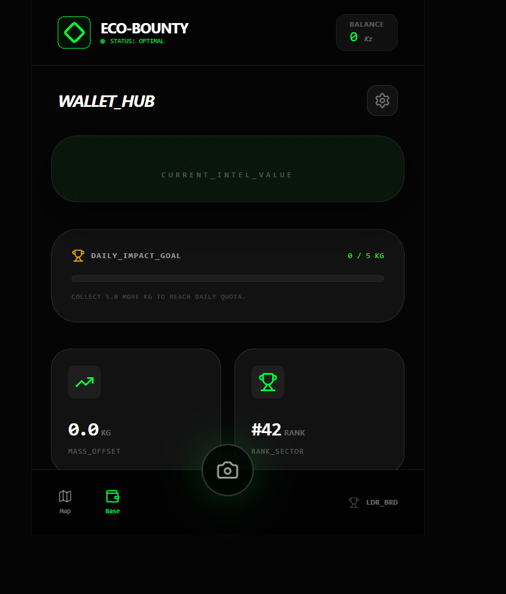
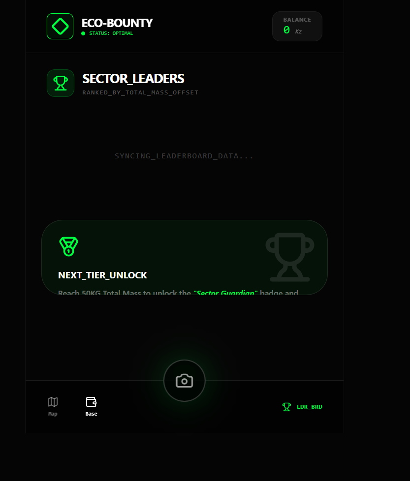

# 🦾 Prox-Recycle — Eco-Bounty Platform

> **Agents League Hackathon 2026 · Track: 🎨 Creative App · Microsoft IQ: Foundry IQ**

A **Cyber-Eco** gamified recycling platform for emerging markets (initial focus: Angola).
Citizens become *Agents* who hunt waste "bounties" on a tactical map, scan their haul
with an AI camera, and earn **Kanza (Kz)** credits payable to mobile money wallets
(e.g. Unitel Money).

Every reward is **grounded and citation-backed by Microsoft Foundry IQ** — so payouts
are auditable, traceable, and resistant to hallucination.

---

## � Screenshots

| Bounty Map | Bounty Detail | Wallet Hub | Leaderboard |
|:---:|:---:|:---:|:---:|
|  |  |  |  |
| Tactical map of live recycling bounties | Surge-priced bounty detail | Kanza balance & daily impact goal | Ranking by total mass recovered |
▶️ **Demo video:** [demo-video/prox-recycle-demo.mp4](demo-video/prox-recycle-demo.mp4) — a 55s walkthrough of the full flow, including the live Foundry IQ grounded scan with citations.
---

## �💡 Microsoft IQ Integration — Foundry IQ

This project integrates the **Foundry IQ** intelligence layer (Azure AI Foundry):
*"agentic knowledge retrieval that delivers cited, grounded answers to reduce hallucination."*

The scanner runs a **two-step pipeline** so that the reasoning stays transparent and auditable:

| Step | Model | Role |
|------|-------|------|
| **1. Vision** | Groq (`meta-llama/llama-4-scout-17b-16e-instruct`) | Looks at the photo and describes the item in plain text (material, condition, rough size). |
| **2. Reasoning** | **Foundry IQ** (`Phi-4-mini-instruct`) | Takes that description and **grounds** it against the recycling knowledge base — classifies the material, computes a fair reward, estimates CO₂ saved, and flags fraud. |
| **Citations** | — | Every scan returns the knowledge-base entry IDs Foundry IQ relied on (e.g. `PRICE-PET`, `CO2-ALU`, `FRAUD-STOCK`), shown live in the scanner UI. |

Splitting *seeing* from *reasoning* means the reward decision is made by Foundry IQ against
ground-truth data, never invented. The agent always cites the entry that justifies the payout,
so each reward is **explainable**.

> Both AI calls live server-side ([server/foundry.ts](server/foundry.ts)) so credentials
> are **never exposed to the browser**. The pipeline is resilient on free tiers: it retries
> with backoff on rate limits, and if Foundry IQ is temporarily throttled it falls back to a
> **deterministic local grounding** that still uses the real Groq vision description — so a
> demo never breaks. With no credentials at all, the app runs in full **mock** mode for
> zero-setup review.

---

## 🏗️ Architecture

```
┌─────────────┐  POST /api/scan   ┌──────────────────┐  1. describe   ┌──────────────┐
│ ScannerView │ ─ base64 image ─▶ │  Express backend  │ ─────────────▶ │ Groq vision  │
│   (React)   │ ◀ JSON+citations  │  (keys stay here) │ ◀─ item text ─ │ (llama-4)    │
└─────────────┘                   └──────────────────┘                └──────────────┘
        │                              │  2. ground + reason         ▼
        │ Firestore (claims, wallet)   ▼                    ┌──────────────────┐
        ▼                     recycling-knowledge.md  ◀──── │ Foundry IQ       │
   Firebase Auth + Firestore   (prices, fraud, CO₂)         │ (Phi-4-mini)     │
                                                            └──────────────────┘
```

- **Frontend:** React 19 + Vite + Tailwind (Cyberpunk theme), `motion/react` animations
- **Backend:** Express ([server/](server/)) — holds all AI credentials, exposes `/api/scan`
- **AI (vision):** Groq `llama-4-scout` describes the photographed item
- **AI (reasoning):** Azure AI **Foundry IQ** (`Phi-4-mini-instruct`) grounds the description against the knowledge base
- **Data:** Firebase Auth + Cloud Firestore (bounties, claims, wallet, leaderboard)

---

## ✨ Features

- 🗺️ **Tactical Bounty Map** — live recycling targets with surge pricing
- 📸 **Grounded AI Scanner** — material, weight, fraud detection + **Foundry IQ citations**
- 🌱 **Impact tracking** — CO₂ saved per claim, grounded in the knowledge base
- 💸 **Wallet Hub** — Kanza balance + simulated mobile-money cash-out
- 🏆 **Leaderboard** — global ranking by total mass recycled

---

## 🚀 Run Locally

**Prerequisites:** Node.js 18+

1. Install dependencies:
   ```bash
   npm install
   ```
2. (Optional) Enable the live pipeline — copy `.env.example` to `.env` and fill in your
   Groq key (vision) and Azure AI Foundry endpoint/key/deployment (reasoning).
   **Skip this to run in mock mode.**
   ```bash
   cp .env.example .env
   ```
3. Run web + backend together:
   ```bash
   npm run dev
   ```
   - Web: http://localhost:3000
   - API: http://localhost:8787 (health check: `/api/health`)

---

## 🔑 Setting up the live pipeline

**Step 1 — Vision (Groq, free):**
1. Get a free API key → https://console.groq.com
2. Add it to `.env`:
   ```env
   GROQ_API_KEY="<your-groq-key>"
   GROQ_MODEL="meta-llama/llama-4-scout-17b-16e-instruct"
   ```

**Step 2 — Reasoning (Foundry IQ / Azure AI Foundry):**
1. Create a free **Azure account** → https://azure.microsoft.com/free
2. Open the **Foundry portal** → https://ai.azure.com and create a resource + project.
3. Deploy a text model (e.g. `Phi-4-mini-instruct`).
4. Copy the **endpoint**, **API key** and **deployment name** into `.env`:
   ```env
   FOUNDRY_ENDPOINT="https://<your-resource>.services.ai.azure.com"
   FOUNDRY_API_KEY="<your-key>"
   FOUNDRY_DEPLOYMENT="Phi-4-mini-instruct"
   FOUNDRY_API_VERSION="2024-05-01-preview"
   ```
5. Restart `npm run dev`. The scanner now shows **`Grounded_by_Foundry_IQ`** with live citations.

> Vision and reasoning are deliberately split: Groq handles *seeing* the item, while
> Foundry IQ handles the *grounded decision* (classification, reward, CO₂, fraud) against
> the knowledge base. To take grounding further, attach `recycling-knowledge.md` as a
> **Foundry IQ knowledge source** to a Foundry Agent in the portal.

---

## 🔒 Security & Disclaimer

- No secrets are committed — `.env*` is git-ignored (see [.gitignore](.gitignore)).
- All AI keys stay **server-side**; the browser only talks to the local API.
- Do **not** upload confidential information (per the hackathon Disclaimer).

---

## 📂 Project Structure

```
server/
  index.ts                     # Express API (keeps credentials server-side)
  foundry.ts                   # Groq vision → Foundry IQ reasoning pipeline + fallback
  knowledge/
    recycling-knowledge.md     # Foundry IQ grounding source (prices, rules, CO₂)
src/
  App.tsx
  components/                  # MapView, ScannerView, WalletView, Leaderboard, Settings
  lib/
    foundry.ts                 # Frontend API client (no keys)
    bountyService.ts           # Firestore logic (grounded rewards)
    firebase.ts
```

---

## 🎯 Hackathon Checklist

- [x] Integrates a Microsoft IQ layer (**Foundry IQ**)
- [x] Grounded, citation-backed AI (Reliability & Safety)
- [x] Credentials secured server-side
- [x] Public repo + README
- [ ] Demo video
